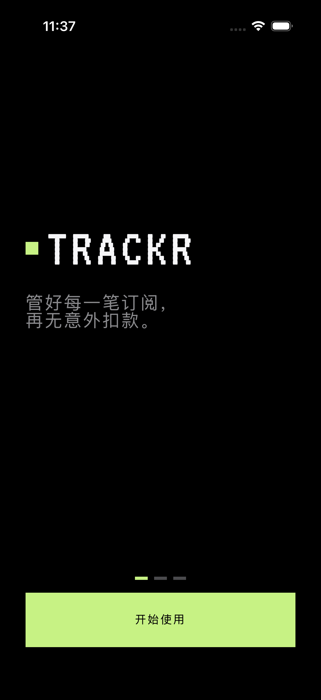

# Trackr

A pixel-aesthetic iOS subscription tracker. Built end-to-end with SwiftUI / SwiftData / StoreKit 2 / WidgetKit, no runtime third-party dependencies.



## Status

Engineering complete through **M9 (pre-launch)**: 218 tests green, 9 git tags `m1-foundation` → `m9-launch`. Submission-ready pending the manual operational checklist in [`docs/release/PRE-LAUNCH.md`](docs/release/PRE-LAUNCH.md) (App Store Connect record, real legal URLs, TestFlight, etc.).

## What it does

- Track recurring subscriptions; see the monthly total at a glance.
- Bundled preset library (~8 popular SaaS) for one-tap add. Tap a row → form pre-fills → save.
- Local notifications fire N days before each renewal at your chosen hour, with same-day aggregation when multiple subs collide.
- Tapping a notification deep-links to that subscription's Detail screen.
- Cache-vs-remote diff catches price changes on tracked presets. In-app banner for everyone; push notification for Pro.
- Pro tier (monthly $2.99 / lifetime $29.99 via StoreKit 2) unlocks unlimited subs, Insights screen, price-change push, and CloudKit sync across devices.
- Small + Medium WidgetKit widgets show the nearest upcoming renewals on the home screen.
- Bilingual: English + Simplified Chinese (system-locale by default; switchable in Settings).

## Architecture

```
Trackr/
├─ Core/                 # Pure logic, fully TDD'd
│  ├─ Models/            # 5 SwiftData @Model types (Subscription, RenewalEvent, …)
│  ├─ Forms/             # SubscriptionDraft — form-model with validation
│  ├─ Repositories/      # SwiftData gateways (Subscription, Alert, Settings)
│  ├─ Cycle/             # RenewalCalculator (drift-safe) + MonthlyTotalCalculator
│  ├─ Money/             # AmountFormatter
│  ├─ Notifications/     # LocalNotificationScheduler + identifier + builder + aggregator
│  ├─ Presets/           # Catalog fetcher + bundle loader + price-change differ + sync
│  ├─ IAP/               # StoreKitClient protocol + ProEntitlement + FeatureGate
│  ├─ Haptics/           # Haptics protocol + UIKit wrapper
│  ├─ Localization/      # LocaleResolver
│  └─ Storage/           # ModelContainerConfig (App Group + CloudKit toggle) + SyncDecider
├─ DesignSystem/         # PixelText, MonoSquareIcon, TrackrButton, DashedDivider, colors, type
├─ Features/             # SwiftUI views — one folder per feature
│  ├─ Home/              # HomeView, SubscriptionRow
│  ├─ AddSubscription/   # AddSubscriptionSheet + PresetLibraryView
│  ├─ Detail/            # SubscriptionDetailView + PriceChangeBanner
│  ├─ Settings/          # SettingsView (language, leadDays, currency, Pro)
│  ├─ Paywall/           # PaywallView + PaywallTriggerCoordinator
│  ├─ Insights/          # InsightsView (Pro-gated totals)
│  ├─ Onboarding/        # 3-page first-launch flow
│  ├─ Widget/            # Small + Medium widget views + TimelineProvider
│  └─ Routing/           # AppDeepLinkRouter + environment keys
├─ Resources/            # Localizable.xcstrings + presets.bundled.json + VT323 font
├─ Assets.xcassets/      # App icon (placeholder)
└─ TrackrApp.swift       # @main — wires everything via SwiftUI environment

Widgets/                  # WidgetKit extension target
TrackrTests/              # XCTest suite (unit + snapshot)
```

**Patterns used:**
- **Repositories** as the only SwiftData gateway — features never touch `ModelContext` directly.
- **Protocol seams** for everything external: `NotificationCenterProtocol`, `StoreKitClient`, `PresetFetcher`. Real implementations are thin forwarders; fakes drive tests.
- **`@Observable` mailboxes** (`PaywallTriggerCoordinator`, `AppDeepLinkRouter`) for cross-cutting one-shot intents.
- **Pure-logic types** (`RenewalCalculator`, `MonthlyTotalCalculator`, `PriceChangeDiffer`, `SyncDecider`, `UpcomingRenewalsProvider`, `FeatureGate`, `SubscriptionDraft`) with 100% deterministic tests.
- **Static `submit` / `applyEdits` / `togglePause` / `performDelete` helpers** on every view so the write paths are testable without hosting the view.
- **`@Environment(...)`** for injecting services (`ProEntitlement`, `Haptics`, `NotificationCoordinator`, `PresetSync`, …) — never global singletons.

## Build

Prerequisites: macOS, Xcode 15.3+, and [XcodeGen](https://github.com/yonaskolb/XcodeGen).

```sh
brew install xcodegen
xcodegen generate
open Trackr.xcodeproj
```

The `.xcodeproj` is gitignored — source of truth is `project.yml`. Re-run `xcodegen generate` whenever the YAML changes or a new Swift file is added.

`Cmd+R` to run on an iOS 17+ simulator, `Cmd+U` to run the full test suite (~218 tests, mix of unit + snapshot).

## Milestones

Engineering-ready through M9. Each milestone is a git tag; the plan documents in [`docs/superpowers/plans/`](docs/superpowers/plans) describe the bite-sized TDD breakdown.

| Tag | What shipped | Tests |
|---|---|---|
| `m1-foundation` | Xcode project, design system (4 components), VT323 pixel font, placeholder Home shell | 21 |
| `m2-data` | 5 SwiftData `@Model`s, 3 repositories, `RenewalCalculator`, `AmountFormatter` | 71 |
| `m3-crud-ui` | Home `@Query` list, Add Subscription form, Detail (edit/pause/delete) | 104 |
| `m4-notifications` | `LocalNotificationScheduler` + same-day aggregation + deep-link + Settings | 134 |
| `m5-presets` | Bundled catalog + remote fetch + `PriceChangeDiffer` + LIBRARY tab + alert banner | 159 |
| `m6-iap` | StoreKit 2 (`.storekit` config), `ProEntitlement`, `FeatureGate`, `PaywallView`, Insights | 183 |
| `m7-widget-sync` | App Group, CloudKit toggle, Small + Medium widgets, `RenewalTimelineProvider` | 196 |
| `m8-polish` | 3-page onboarding, en + zh-Hans `.xcstrings`, app icon, haptics, Settings complete | 205 |
| `m9-launch` | `BrandConfig` swap surface, store screenshot tests, release runbook + checklist | 218 |

## Testing

Unit tests cover pure logic; snapshot tests (via [swift-snapshot-testing](https://github.com/pointfreeco/swift-snapshot-testing)) pin every SwiftUI screen to a baseline PNG. Two recurring patterns make views testable without a UI host:
- **Static helpers** (`AddSubscriptionSheet.submit`, `SubscriptionDetailView.applyEdits`, etc.) take `(draft, context, coordinator, …)` and return `Result`-style state, so the write paths run in plain `XCTestCase` against an in-memory `ModelContainer`.
- **Protocol fakes** (`FakeNotificationCenter`, `FakeStoreKitClient`, `FakePresetFetcher`, `FakeHaptics`) sit behind narrow protocols. Tests inject them; assertions read back recorded calls.

```sh
xcodegen generate
xcodebuild -project Trackr.xcodeproj -scheme Trackr \
  -destination 'platform=iOS Simulator,name=iPhone 16,OS=18.1' test
```

## Project Layout

```
.
├─ Trackr/                 # iOS app target
├─ Widgets/                # WidgetKit extension target
├─ TrackrTests/            # XCTest unit + snapshot suite
├─ docs/
│  ├─ superpowers/
│  │  ├─ specs/            # 1 doc: subscription-tracker-design.md
│  │  └─ plans/            # 10 docs: roadmap + 9 milestone plans
│  └─ release/             # M9 ops runbook + release checklist
├─ Trackr.entitlements     # App Group + iCloud
├─ Widgets.entitlements    # App Group
├─ Configuration.storekit  # Local StoreKit sandbox (monthly + lifetime)
├─ project.yml             # XcodeGen source of truth
└─ README.md
```

## Engineering Notes

The Xcode project file (`Trackr.xcodeproj/`) is **never committed** — it's regenerated from `project.yml` by [XcodeGen](https://github.com/yonaskolb/XcodeGen) on every dev box. This kills the merge-conflict tax that plagues hand-edited `.pbxproj` files and makes every project setting visible in source.

CloudKit sync is wired but gated on (Pro entitlement AND signed-in iCloud account); the local simulator runs `.localOnly` by default. The cross-device sync requires production Apple Developer team provisioning, documented in M9's [`docs/release/PRE-LAUNCH.md`](docs/release/PRE-LAUNCH.md).

The remote preset catalog URL is intentionally unreachable (`https://presets.invalid/...`) until M9 swaps in the production host. The bundled JSON drives the LIBRARY tab in the meantime.

The two product IDs in `Configuration.storekit` use a `com.placeholder.trackr.*` prefix throughout. M9's swap surface (the new `BrandConfig` Swift enum + `PRE-LAUNCH.md` swap list) tracks every site that needs updating when a real Apple Developer team prefix is assigned.

## License

TBD — pending the M9 name lock + legal review.
